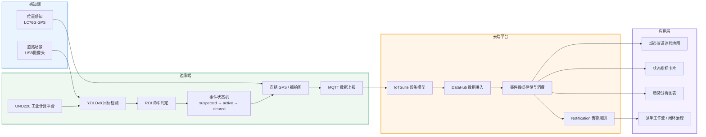

# 第三页系统架构图

这版适合放在“课题方案设计 / 系统总体架构”页，风格偏课程设计汇报，强调端边云协同与业务闭环。

## PPT 中的标题建议

- 主标题：课题方案设计
- 副标题：基于边云协同的城市盲道违规占用监测系统总体架构

## 页面右侧可配的三句说明

1. 感知端采集道路视频与位置信息，为事件识别提供原始输入。
2. 边缘端基于 UNO220 完成目标检测、状态判定、坐标冻结与 MQTT 上报。
3. 云端平台实现地图展示、指标分析、告警联动与治理闭环。

