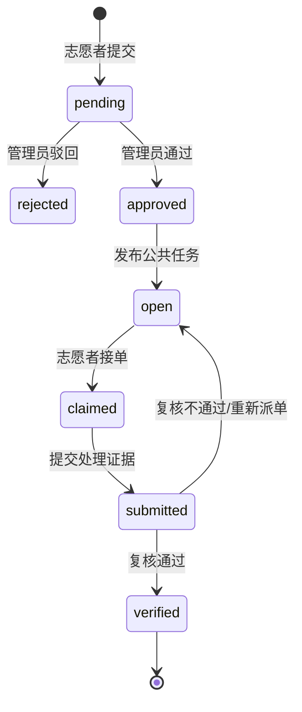

# 系统架构

## 1. 设计目标

视桥围绕城市盲道障碍建立“机器发现 + 人工补充 + 公共处置”的统一闭环。系统优先保证边缘推理不中断、业务状态可追踪、地图信息可解释和媒体链路可降级。

## 2. 组件职责

| 组件 | 职责 | 持久化/状态 |
| --- | --- | --- |
| `edge/pi-runtime` | 摄像头与 GNSS 采集、ONNX 推理、事件去抖、快照、遥测队列 | 本地运行状态与可选快照 |
| `services/api` | 认证、设备、事件、上报、障碍物、任务与复核 API | SQLite、图片目录 |
| `apps/dashboard` | 管理员审核、事件地图、设备健康、实时视频 | 浏览器内短期 UI 状态 |
| `apps/volunteer` | 邮箱登录、拍照上报、地图选点、接单和处理凭证 | 本地会话令牌与 UI 状态 |
| `MediaMTX` | 接收 RTSP，提供 WHEP/WebRTC 与 HLS | 内存媒体会话 |
| `coturn` | 浏览器与云端不能直连时提供 TURN 中继 | 短期中继会话 |
| `Nginx` | 同源静态页面、API 和媒体反向代理 | 无业务状态 |

## 3. 业务数据流

### 3.1 边缘识别

1. USB 摄像头持续写入最新帧缓冲，GNSS 独立更新定位；
2. 推理线程只处理最新帧，避免积压导致“画面实时但识别落后”；
3. 连续命中达到阈值后生成事件，冷却窗口内抑制重复事件；
4. 遥测由独立队列上传，失败采用指数退避，网络阻塞不影响推理；
5. API 按来源事件 ID 去重，并更新设备最后在线时间与事件状态。

### 3.2 志愿者上报与处置

只有审核入库且仍开放的障碍物出现在公共地图；复核通过后从未处理队列移除，但保留审计记录。待审核上报可由提交者删除，审核进入公共记录后只能由管理员撤销。

## 4. 数据模型

主要实体包括：

- `devices`：设备 ID、名称、状态、最后心跳与最新遥测；
- `telemetry`：边缘设备时序数据；
- `events`：机器识别或志愿者审核后形成的标准事件；
- `users`、`auth_sessions`：志愿者身份与会话；
- `volunteer_reports`：志愿者原始上报与审核结果；
- `obstacles`：进入公共地图的障碍物；
- `public_tasks`：公共任务、认领人与处置状态；
- `task_evidence`：处理照片、说明和复核结果。

当前 SQLite 适合单节点原型。多实例部署前应迁移 PostgreSQL，并将照片和快照迁移到对象存储。

## 5. 一致性与刷新

- 管理大屏默认 3 秒拉取一次，App 默认 6 秒刷新当前页面；
- 页面恢复可见、App 回到前台、审核/接单/提交等写操作后立即刷新；
- API 是唯一业务事实源，前端不在本地推导最终任务状态；
- 当前短轮询简单可靠，但设备和用户增长后应改为 WebSocket/SSE 通知加按需查询。

## 6. 视频链路

边缘进程提供标注后的原始帧；FFmpeg 优先使用树莓派硬件 H.264 编码，经 RTSP/SSH 隧道发布到 MediaMTX。浏览器优先使用 WHEP/WebRTC，无法建立 ICE 直连时由 coturn 中继；HLS 仅作为兼容回退。

多设备以稳定 `device_id` 映射到 `devices/{device_id}` 媒体路径。媒体发布凭据与业务登录凭据分离，浏览器只有读取权限。

## 7. 信任边界

- 边缘上传：Bearer Token；每台设备应使用独立令牌，当前原型仍是共享令牌；
- 志愿者：邮箱验证码 + 有过期时间的会话令牌；
- 管理端：生产环境必须启用独立管理员认证和 RBAC；
- 媒体：发布密钥仅保存在设备和服务器，TURN 使用独立共享密钥；
- 外部服务：高德地图仅接收地图展示所需坐标；QQ SMTP 仅用于验证码邮件。

## 8. 生产化演进

1. PostgreSQL、对象存储和数据库迁移工具；
2. 管理员 RBAC、审计日志和高风险操作二次确认；
3. 每设备凭据、自动轮换和吊销；
4. Prometheus/OpenTelemetry、结构化日志与告警；
5. WebSocket/SSE 事件通知和任务并发认领压力测试；
6. 图片保留周期、匿名化、用户注销和数据导出流程。
