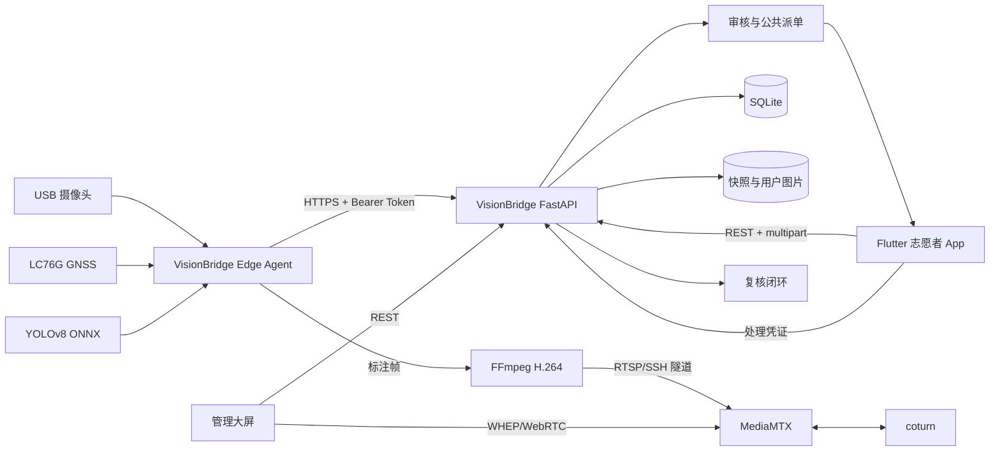

# 当前系统流程图

```mermaid
flowchart LR
    Camera[USB 摄像头] --> Edge[VisionBridge Edge Agent]
    GNSS[LC76G GNSS] --> Edge
    Model[YOLOv8 ONNX] --> Edge

    Edge -->|HTTPS + Bearer Token| API[VisionBridge FastAPI]
    Edge -->|标注帧| FFmpeg[FFmpeg H.264]
    FFmpeg -->|RTSP/SSH 隧道| Media[MediaMTX]

    API --> DB[(SQLite)]
    API --> Files[(快照与用户图片)]
    Media <--> TURN[coturn]

    Dashboard[管理大屏] -->|REST| API
    Dashboard -->|WHEP/WebRTC| Media
    Volunteer[Flutter 志愿者 App] -->|REST + multipart| API

    API --> Review[审核与公共派单]
    Review --> Volunteer
    Volunteer -->|处理凭证| API
    API --> Closed[复核闭环]
```

该图描述当前唯一活动链路。研华 IoTSuite/DCCS/MQTT 只属于历史验证阶段，不参与当前数据传输。
