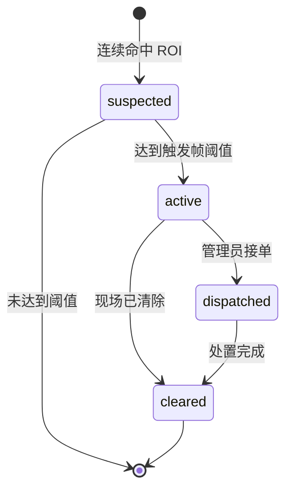

# 视桥云端可视化平台：需求规格与接口设计

> 版本：1.2｜阶段：自有云直传 + 志愿者协同闭环｜更新时间：2026-08-02

## 1. 项目目标

将“USB 摄像头 + LC76G GNSS + YOLOv8 + 事件状态机”形成的数据直接上传到视桥自有云，构建可独立部署、可接入真实硬件、可追踪事件闭环的 Web 监管平台。运行链路不经过研华 IoTSuite 或其他第三方数据平台。

一期必须做到：

1. 树莓派识别主进程完成推理、事件判定和自有云直传，不再连接研华 DCCS/MQTT。
2. 主进程使用异步队列上传，云端短时不可用时退避重试，不阻塞视觉推理。
3. 云端完成遥测接收、事件入库、设备健康计算、查询接口和处置接口。
4. 网站完成地图总览、事件中心、设备状态、趋势分析、数据接口和志愿者协同六个模块。
5. Flutter 志愿者 App 完成邮箱登录、地图总览、拍照上报、公共任务认领和处置闭环。
6. 硬件断网、云端暂时不可用或高德地图加载失败时，界面可降级而不崩溃。

## 2. 角色与核心任务

| 角色 | 核心任务 | 首屏关注内容 |
|---|---|---|
| 监管人员 | 快速发现当前占用并判断严重程度 | 活动事件、空间位置、设备在线状态 |
| 处置人员 | 接单、到场、确认清除 | 事件位置、类型、置信度、持续时间、处置状态 |
| 志愿者 | 拍照上报、查看审核进度、认领公共任务、提交处置凭证 | 周边障碍、待认领任务、个人上报与任务状态 |
| 技术人员 | 判断边缘端与云端是否稳定 | 摄像头、GPS、FPS、推理延迟、上报时间 |
| 比赛评委 | 在短时间内理解完整方案 | 边缘识别—云端同步—事件闭环全过程 |

## 3. 一期范围

### 3.1 本期包含

- 监管总览：首页 KPI、2D 地图、设备健康、事件队列、趋势与风险构成。
- 事件中心：按状态筛选、查看详情、接单、确认清除。
- 边缘设备：摄像头、GPS、模型版本、推理耗时、帧率、最近位置。
- 趋势分析：事件数量、推理耗时、采集帧率。
- 数据与接口：数据源说明、边云数据流、API 清单。
- 实时数据：树莓派状态每 5 秒上传，自有云更新设备状态。
- 演示数据：保留三条明确标记为“历史演示样例”的事件，避免无事件时页面完全空白。
- 志愿者 App：QQ 邮箱验证码登录、地图障碍物总览、拍照定位上报、公共任务、我的上报与我的任务。
- 志愿者协同后台：上报审核、障碍入库、地图同步、公开派单和处置结果复核。

### 3.2 本期不包含

- 多组织、多租户和复杂权限体系。
- 小程序和短信通知；手机 App 已纳入本期范围。
- 训练集管理、在线标注与模型训练。
- 研华 IoTSuite 的配置反向同步。
- 视频流穿透公网；一期只同步状态、事件和事件抓拍。

## 4. 数据来源

| 数据源 | 产生位置 | 获取方式 | 更新频率 | 主要字段 | 一期用途 |
|---|---|---|---:|---|---|
| USB 摄像头 | 树莓派 `/dev/video0` | OpenCV/MJPG | 实时 | 分辨率、FPS、检测框 | 识别输入、设备健康 |
| YOLOv8 ONNX | 树莓派边缘程序 | 本地推理 | 约 0.6–1.2 秒/次 | 类别、置信度、推理耗时 | 事件判断、性能监控 |
| ROI 与事件状态机 | 树莓派边缘程序 | 内存状态 | 每帧更新 | suspected/active/dispatched/cleared | 去抖、去重、闭环 |
| LC76G GNSS | `/dev/ttyUSB1` | NMEA 0183 | 最高 5 Hz | 经纬度、卫星数、HDOP、航向 | 事件定位、轨迹质量 |
| 边缘直传模块 | 树莓派识别主进程 | HTTPS/HTTP REST + Bearer Token | 5 秒/事件即时 | runtime、gps、iot_properties、抓拍 | 唯一上云链路 |
| 边缘状态接口 | `127.0.0.1:8090/status.json` | HTTP JSON | 运行时实时 | runtime、gps、iot_properties | 本机调试与运维，不作为上云中转 |
| 视桥自有云 | Ubuntu 云服务器 | REST + SQLite | 5 秒 | 设备、遥测、事件、处置 | 网站统一数据源 |
| 高德地图 | 高德 JS API 2.0 | 浏览器 JS API | 按页面加载 | GCJ-02 底图、标记 | 空间态势展示 |
| 志愿者现场上报 | Flutter App | HTTPS/HTTP REST + multipart | 人工触发 | 照片、分类、原因、描述、经纬度 | 补充固定障碍、施工、坑洼等机器暂未覆盖的问题 |

志愿者端的状态机、页面清单、权限边界和完整 API 见《视桥_志愿者App_需求规格与接口设计.md》。

## 5. 数据标准化

前端不直接消费树莓派原始 JSON。云端负责把直传字段转换为统一语义：

| 原始字段 | 云端字段 | 展示语义 |
|---|---|---|
| `cameraStatusCode` | `device.cameraStatus` | 摄像头是否采集正常 |
| `gpsStatusCode`、`numSats`、`hdopX100` | `device.gpsStatus/sats/hdop` | GNSS 串口与定位质量 |
| `cameraFpsX100` | `device.cameraFps` | 实际采集 FPS |
| `inferenceMs` | `device.inferenceMs` | 单次模型推理耗时 |
| `eventActive` | `event.status` | 当前是否存在活动事件 |
| `obstacleTypeCode`、`last_obstacle_type` | `event.type/typeLabel` | 非机动车、两轮机动车、施工杂物 |
| `obstacleConfidence` | `event.confidence` | 模型置信度百分比 |
| `gpsLatE6/gpsLngE6` 或 `gps.lat/lng` | `event.lat/lng` | GCJ-02 地图坐标 |
| `last_snapshot_name` | `event.snapshotUrl` | 事件抓拍访问地址 |

## 6. 事件状态与操作



约束：

- 只有首次进入 `active` 才创建事件，避免逐帧重复上报。
- `active` 时冻结首次确认的时间、位置和抓拍。
- 网站的“接单处置”写入 `dispatched`，“确认已清除”写入 `cleared`。
- 历史演示样例和真实硬件事件必须在 `source` 字段上可区分。

## 7. API 设计

基础路径：`/api/v1`

| 方法 | 路径 | 鉴权 | 说明 |
|---|---|---|---|
| `GET` | `/health` | 无 | 云端健康检查 |
| `POST` | `/telemetry` | Bearer 设备令牌 | 边缘状态、事件和抓拍上报 |
| `GET` | `/overview` | 公开只读 | 首页聚合数据 |
| `GET` | `/config/public` | 公开只读 | 高德前端配置和默认中心点 |
| `GET` | `/events` | 公开只读 | 事件列表，支持状态筛选 |
| `PATCH` | `/events/{id}` | Web 基础认证 | 接单或清除事件 |
| `GET` | `/devices` | 公开只读 | 设备列表与健康状态 |
| `GET` | `/snapshots/{file}` | 公开只读 | 事件抓拍 |
| `WS` | `/ws/realtime` | 公开只读 | 实时心跳与后续增量推送 |

### 7.1 遥测上报示例

请求头：`Authorization: Bearer <device-token>`

```json
{
  "ts": "2026-08-02T15:51:51+08:00",
  "device": {
    "device_id": "uno-cloud-gateway-01",
    "point_name": "blindway-point-01"
  },
  "runtime": {
    "camera_fps": 7.8,
    "inference_ms": 672,
    "last_event_id": "evt-xxxx",
    "last_obstacle_type": "construction_obstacle"
  },
  "gps": {
    "status": "connected",
    "lat": 28.632112,
    "lng": 121.138923
  },
  "iot_properties": {
    "eventActive": 0,
    "cameraStatusCode": 1,
    "gpsStatusCode": 1
  }
}
```

## 8. 非功能要求

- 首屏：普通桌面网络下 3 秒内显示框架，地图失败时自动展示降级图层。
- 刷新：设备状态 5 秒轮询；90 秒未上报判定离线。
- 安全：设备令牌和高德安全码只保存在服务器或树莓派权限受限的环境文件中。
- 可恢复：主进程内置上传线程；网络失败自动退避重试，不阻塞或退出边缘识别。
- 数据量：一期 SQLite 保留最近 50,000 条遥测，事件永久保留。
- 响应式：支持 1366×768 演示屏、常规桌面和手机查看。
- 可访问性：按钮有键盘焦点、颜色之外同时使用文字表达状态。

## 9. 验收标准

1. 云服务器 `/api/v1/health` 返回正常。
2. 树莓派识别主服务持续运行，云端最近上报时间每 5 秒更新。
3. 网站设备页显示树莓派真实 FPS 与推理耗时。
4. 停止树莓派主服务后 90 秒，网站将设备标记为离线。
5. 创建活动事件后，地图、队列和事件中心出现同一事件。
6. 接单与清除操作能更新事件状态并写入数据库。
7. 高德地图正常加载；配置缺失时降级地图仍可操作事件点。
8. 树莓派运行配置与代码不包含 DCCS/MQTT/研华工作流连接，唯一远端写入目标为视桥自有云。

## 10. 后续迭代

- 二期：HTTPS 与自有域名、角色权限、短信/企业微信通知、实时视频代理。
- 三期：多设备轨迹、热力图、数据集回流与模型版本管理。
