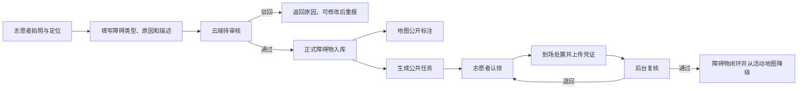

# 视桥志愿者 App：需求规格与接口设计

> 版本：1.1.1｜客户端：Flutter｜服务端：视桥自有云 FastAPI + SQLite｜更新时间：2026-08-03

## 1. 产品定位

视桥志愿者 App 是现有“树莓派边缘识别—自有云—监管大屏”之外的人工协同入口。机器巡检发现动态占用，志愿者补充机器暂时难以覆盖的固定或复杂问题，两类数据在云端统一审核、入库、上图、派单和闭环。

典型上报场景：

1. 志愿者当时不方便或不适合直接清理；
2. 店铺台阶、固定高差、长期占道设施等不可移动问题；
3. 临时施工、路面坑洼破损等普通志愿者无法安全处理的问题；
4. 车辆、杂物等可清理障碍，但需要其他志愿者或管理人员协助。

## 2. 角色与权限

| 角色 | 能力 |
|---|---|
| 游客 | 查看产品说明和隐私说明，申请邮箱验证码 |
| 志愿者 | 地图查看、拍照上报、查看审核进度、认领公共任务、提交处置凭证 |
| 审核员 | 审核或驳回上报、修正分类和优先级、决定是否公开派单 |
| 管理员 | 审核员全部能力、复核任务完成、查看审计记录和系统配置 |

## 3. 业务闭环

## 4. 状态模型

### 4.1 上报状态

- `pending`：等待后台审核；
- `approved`：审核通过并已生成正式障碍物；
- `rejected`：驳回，必须返回审核说明。

### 4.2 障碍物状态

- `open`：已入库、地图可见；
- `assigned`：任务已被认领；
- `resolving`：志愿者已提交处理结果，等待复核；
- `resolved`：已复核闭环；
- `archived`：不再公开但保留历史。

### 4.3 公共任务状态

- `open` → `claimed` → `submitted` → `verified`；
- 复核不通过时从 `submitted` 返回 `claimed`；
- 管理员可将无效任务设为 `cancelled`。

认领使用数据库条件更新，确保同一任务不能被多人同时抢占。

## 5. 障碍分类

| 代码 | 展示名称 | 默认建议 |
|---|---|---|
| `temporary_obstacle` | 临时杂物/堆放 | 可公开派单 |
| `shop_step` | 店铺台阶/固定高差 | 转管理部门或长期治理 |
| `construction` | 临时施工 | 高风险，不建议个人处置 |
| `road_damage` | 路面坑洼/破损 | 转市政处置 |
| `vehicle` | 车辆占用 | 可巡查、劝离或转管理部门 |
| `other` | 其他障碍 | 由审核员判断 |

无法现场清理原因：`unable_now`（当时不方便）、`fixed_barrier`（固定障碍）、`unsafe_to_clear`（不具备安全处理条件）。

## 6. App 页面

### 6.1 首期必须实现

1. **隐私与安全说明**：说明拍照、定位、相册、地图 SDK 的使用目的；同意后才初始化高德定位/地图。
2. **邮箱验证码登录**：输入邮箱、获取 6 位验证码、首次登录可补充 1–30 字符昵称或留空使用邮箱前缀；采用无密码登录，不保存用户密码。
3. **地图总览**：展示全部活动障碍物，按优先级筛选；支持当前位置、地图直接标注上报位置、点标记查看详情并进入任务大厅。
4. **拍照上报向导**：拍照/相册、障碍分类、无法清理原因、文字描述、GPS 自动定位/地图手动选点与逆地址、提交确认。
5. **任务大厅**：按距离、类型、优先级筛选公共任务，展示距离、发布时间、风险提示和认领状态。
6. **任务详情**：照片、地图位置、描述、安全提示、认领按钮；处置后提交说明与完成照片。
7. **我的上报**：显示待审、通过、驳回及审核意见；本人可删除待审核或已驳回记录，已审核进入公共地图的数据不可由个人直接删除。
8. **我的任务**：显示已认领、待复核、已完成任务；任务详情可调起高德步行导航，处理凭证支持相机或相册。
9. **我的/设置**：个人信息、积分占位、隐私设置、退出登录、高德审图号与版本信息。

底部主导航采用四项：`地图`、`上报`、`任务`、`我的`。上报按钮使用高辨识度的中心动作样式。

### 6.2 v1.1 真实用户场景优化

- 首次登录允许单字昵称或留空，客户端先校验并把后端错误转换为中文操作提示，不再展示 Pydantic 原始结构。
- 修复地图配置异步返回后 WebView 未补建的问题；增加 15 秒超时、失败原因、手动重试和仍可选点的降级地图。
- 手机 GPS 的 WGS-84 坐标在端内转换为 GCJ-02，避免在高德底图产生数百米偏移。
- 地图总览可直接标注问题位置并跳转上报；上报页可在全屏地图反复调整标记并自动回填逆地址。
- 根据店铺台阶、施工、坑洼等分类自动建议“固定障碍/不具备安全处理条件”，降低表单操作量并强化安全边界。
- 任务认领增加二次确认和安全提示，任务详情增加步行导航，完成凭证支持相机和相册。
- “我的上报”提供照片、位置、原因、审核意见的完整详情，不再只显示前 5 条摘要。
- 所有网络请求增加超时，上传失败保留当前内容；过期会话启动时自动回到登录页。

### 6.3 后续迭代

- 推送通知、志愿服务时长和积分；
- 组织/学校志愿队；
- 举报重复合并、相似图片检测；
- 无障碍路线风险提醒；
- 任务评价、申诉与黑名单。

## 7. Web 后台补充页面

1. **志愿者审核**：待审核数量、上报照片、地图位置、分类、描述和无法清理原因；支持通过、驳回、修正优先级和是否派单。
2. **公共派单**：公开、已认领、待复核、已完成任务；显示认领人、时限和处理凭证。
3. **完成复核**：比较上报照片与处理后照片，通过后同步关闭障碍物和现有事件地图标记。

比赛演示阶段按项目要求临时关闭审核台 Basic Auth，打开页面即可审核；设备上传令牌和 App 用户 Bearer 认证不变。正式长期公网运行前必须恢复管理员认证。

## 8. 邮箱认证与安全

- QQ 邮箱仅作为 SMTP 发件服务，App 用户可使用任意格式合法的邮箱地址；
- SMTP 推荐 `smtp.qq.com:465` + SSL，密码使用 QQ 邮箱生成的 SMTP 授权码；
- 发件账号、授权码只保存于云服务器 `/etc/visionbridge/api.env`，不得写进 Flutter、Git 或公开文档；
- 验证码 6 位、10 分钟失效、最多尝试 5 次、60 秒内禁止重复发送；
- 登录令牌为随机不透明令牌，服务器只保存 SHA-256 哈希，可撤销，默认 30 天过期；
- 截图中已出现过的 SMTP 授权码视为泄露，正式联调前必须重新生成。

## 9. API v1

| 方法 | 路径 | 鉴权 | 说明 |
|---|---|---|---|
| `POST` | `/auth/email/request` | 无 | 发送登录/注册验证码 |
| `POST` | `/auth/email/verify` | 无 | 验证并创建会话 |
| `GET` | `/auth/me` | 用户 Bearer | 当前志愿者资料 |
| `POST` | `/auth/logout` | 用户 Bearer | 撤销当前令牌 |
| `POST` | `/volunteer/reports` | 用户 Bearer | multipart 照片上报 |
| `GET` | `/volunteer/reports/mine` | 用户 Bearer | 我的上报 |
| `GET` | `/map/obstacles` | 公开只读 | 地图活动障碍物 |
| `GET` | `/volunteer/tasks` | 用户 Bearer | 公共任务大厅 |
| `POST` | `/volunteer/tasks/{id}/claim` | 用户 Bearer | 原子认领任务 |
| `POST` | `/volunteer/tasks/{id}/complete` | 用户 Bearer | 提交说明和完成照片 |
| `GET` | `/volunteer/tasks/mine` | 用户 Bearer | 我的任务 |
| `DELETE` | `/volunteer/reports/{id}` | 用户 Bearer | 删除本人待审核或已驳回上报 |
| `GET` | `/admin/reports` | 临时免登录 | 审核列表及各状态数量 |
| `GET` | `/admin/operations/summary` | 临时免登录 | 上报、任务、障碍状态链一致性摘要 |
| `PATCH` | `/admin/reports/{id}` | 管理员 Basic | 通过或驳回并决定派单 |
| `GET` | `/admin/tasks` | 管理员 Basic | 派单管理 |
| `PATCH` | `/admin/tasks/{id}` | 管理员 Basic | 完成复核或退回 |

## 10. 非功能要求

- 照片支持 JPEG/PNG/WebP，单张不超过 8 MiB；上传前 App 侧压缩，服务器再次校验；
- 坐标统一为 GCJ-02；当前 Android App 使用 WebView 加载自有云托管的高德 JS API 页面，因此使用 Web JS Key 与安全密钥，不在 APK 中硬编码；如后续切换原生地图 SDK，再申请 Android/iOS 平台独立 Key；
- 地图 SDK 初始化前必须完成隐私展示与用户同意；“关于”页展示高德审图号；
- 网络失败时保留上报草稿并允许重试；不得把失败上报伪装成成功；
- 固定障碍、施工和坑洼默认显示安全警告，避免引导志愿者进行危险处置；
- App 不直接连接数据库或 SMTP，所有数据经视桥自有云 API。

## 11. 首期验收

1. 邮箱验证码可完成首次注册和再次登录；
2. 登录用户可拍照、定位、选择原因并提交上报；
3. 后台能看到待审核上报及原图，驳回时 App 可看到原因；
4. 审核通过后，Web 大屏和 App 地图均出现同一障碍物；
5. 选择公开派单后，任务出现在 App 任务大厅；
6. 两个用户同时认领时只能有一个成功；
7. 认领人可提交处理照片，后台复核后地图状态变为已闭环；
8. 源码、APK 和前端资源中均不存在 SMTP 授权码或服务器管理密码。
9. 上报者只能删除本人未进入公共数据的记录，其他用户删除返回 404，已审核记录删除返回 409；
10. 任务 `open → claimed → submitted → verified` 时障碍与监管事件状态同步，一致性摘要无异常。
