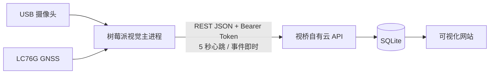

# 视桥边缘端：自有云直传说明

## 当前唯一运行链路

- 主程序：`pi-runtime/visionbridge_edge_agent.py`，不连接 IoTSuite、DCCS 或 MQTT。
- 启动脚本：`pi-runtime/run_visionbridge_edge.sh`。
- systemd：`visionbridge-edge-agent.service`。
- 传输目标：`VISIONBRIDGE_CLOUD_URL`，当前为自有云 `/api/v1/telemetry`。
- 鉴权：`VISIONBRIDGE_INGEST_TOKEN`，仅放入树莓派权限受限的环境文件，不写入源码。
- 可靠性：上传在线程内执行，失败指数退避重试；视觉推理线程不等待网络。
- 事件：首次进入 active 时立即上传状态与抓拍；普通设备状态按 `HEARTBEAT_INTERVAL` 上传。

## 已停用内容

- 研华 DCCS 服务凭据获取。
- 研华 MQTT report/heartbeat 发布。
- 研华工作流运行配置。
- 独立轮询型 `visionbridge-cloud-bridge.service`（实机已 inactive / disabled）。

## 必需环境变量

参见 `pi-runtime/visionbridge_edge.env.example`。部署文件为 `/etc/visionbridge/edge.env`，权限不高于 `0640`。
